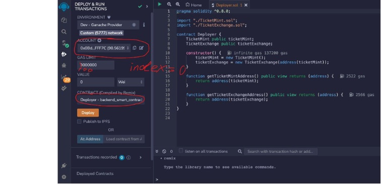

# NFT_Ticket_Exchange_dApp
Solidity/Smart Contract/Remix/MetaMask/Ganache/VS code/Streamlit/Python/Json/

# UCB Graduation Dinner Seat Purchase Smart Contract May 2023

// SPDX-License-Identifier: MIT 

---
'''
The purpose of this contract is to purchase invitations to UCB Graduation Dinner.

The contract allows for a total of eight unique invitations to be minted. Each invitation has a fixed price of 10 Ether. Once minted, these invitations can be gifted to other Ethereum addresses. Additionally, the owner of the contract has access to withdraw the balance accumulated from minting operations.

This contract maintains a count of minted invitations and the Ethereum address that minted each invitation. It restricts users from minting more than one invitation and prevents re-minting of an invitation that has already been minted.

'''
## Technologies
 The Contract uses the following technologies:

 - Solidity
 - Web3.py
 - Streamlit
 - Pillow(PIL)
 - Ganache
 - JSON
 - Python 3.8
 - Ethereum


---
## Installation Guide

Click [Here](https://docs.github.com/en/repositories/creating-and-managing-repositories/cloning-a-repository?tool=cli). For instructions on how to clone this repository from github.

Click [Here](https://trufflesuite.com/docs/ganache/quickstart/). For instructions to download Ganache, when prompted choose the quickstart method.

Click [Here](https://support.metamask.io/hc/en-us/articles/360015489531-Getting-started-with-MetaMask#:~:text=will%20automatically%20open.-,You%20can%20also%20make%20sure%20it's%20easily%20accessible%20in%20your,selecting%20%22Show%20in%20Toolbar%22.&text=Click%20%E2%80%9CDownload%22.,%22Install%20MetaMask%20for%20Chrome%22.). For instructions on how install Metamask.


Click [Here](https://code.visualstudio.com/download). For instructions to download Virtual Studio.

Click [Here](https://remix.ethereum.org/). To Launch remix.etherum.org

Click [Here](https://docs.streamlit.io/library/get-started/installation). For instructions to install streamlit.


## Launch

### Deploy Smart Contracts on Remix.

On Remix, upload the folder cloned from github.


Click on "InvitationMint.sol" found in 

nft_invitation_dApp>>Contract>>InvitationMint.sol


### Run Streamlit page

To run the streamlit page, locate the nft_invitation_dapp from the command line interface


Now enter the following command.
```
streamlit run app_0529.py
```
 You should see this in your terminal along with the streamlit page popping up.
 
 

 st, deploy the deployer.sol
chose environment “Dev-Ganache Provider”

  
change RPC Endpoint from  8545 to 7545, click OK
                 


change GAS LIMIT to 100000000, copy paste index 0 address from Ganache, choose Deployer contract, click Deploy.


In the Deployed Contracts section, expand “DEPLOYER AT”


Second, deploy the TicketMint contract
in the DEPLOYER contract, click “getTicketMint”, copy the address you get from this function, paste it into the blank beside `At Address` ,  as the picture shows. then in the CONTRACT section, choose TicketMint contract, click `At Address.`


Then, deploy the TicketExchange contract
in the Deployed Contract section, click the `copy` icon beside the  “TICEKTMINT”, paste it into the blank beside `At Address` ,  as the picture shows. then in the CONTRACT section, choose TicketExchange contract, click `At Address.`


Now you can mint Ticket using the `mintTicket` function in TICKETMINT contract


1. in TRANSACTIONS section, set value = 1 Ether
2. click the mintTicket function, copy paste index 1 address in Ganache as owner, set seatNumber as 1, then click transact. 


---
## Usage


---
## Contributors

Demi Gao, Jonathan Cruz, Julio Rodriguez, and Cary Gutknecht

